# Spring Cloud Stream

## Section 01: Introduction to Spring Cloud Stream

### What is Spring Cloud Stream?

Spring Cloud Stream is a framework for building **event-driven** and **message-driven** microservices.

It provides a programming model that allows applications to communicate through messaging systems without directly depending on the messaging platform APIs.

Instead of writing Kafka-specific or RabbitMQ-specific code, developers write business logic using Java functional interfaces, and Spring Cloud Stream handles the integration with the messaging infrastructure.

---

## Why is Spring Cloud Stream Needed?

Without Spring Cloud Stream, applications usually interact directly with messaging systems using vendor-specific APIs.

### Architecture

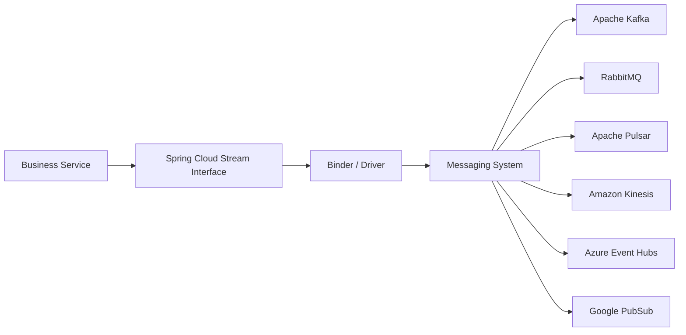

### Benefits

- Messaging-system abstraction
- Reduced boilerplate code
- Easier testing
- Vendor independence
- Functional programming model
- Built-in retry handling
- Dead Letter Topic support
- Transaction support
- Reactive support

---

## Supported Messaging Systems

Spring Cloud Stream currently supports:

| Messaging System | Binder Required |
|----------|----------|
| Apache Kafka | Kafka Binder |
| RabbitMQ | RabbitMQ Binder |
| Apache Pulsar | Pulsar Binder |
| Kafka Streams | Kafka Streams Binder |
| Amazon Kinesis | Kinesis Binder |
| AWS SNS/SQS | SNS/SQS Binder |
| Azure Event Hubs | Event Hub Binder |
| Google PubSub | PubSub Binder |
| Apache RocketMQ | RocketMQ Binder |

When using Kafka, the Kafka Binder acts as the driver between Spring Cloud Stream and Kafka.

---

# Event-Driven Application Types

Applications generally fall into three categories:

## 1. Producer

Produces events.

- Publishes messages
- Doesn't know who consumes them
- Doesn't care how many consumers exist

Example:

```java
@Bean
public Supplier<OrderEvent> orderEventProducer() {
    return () -> generateOrder();
}
```

---

## 2. Consumer

Consumes events.

- Receives messages
- Doesn't know who produced them

Example:

```java
@Bean
public Consumer<PaymentEvent> paymentEventConsumer() {
    return event -> process(event);
}
```

---

## 3. Processor

Consumes events and produces new events.

Acts as both:

- Consumer
- Producer

Example:

```java
@Bean
public Function<OrderEvent, PaymentEvent> paymentProcessor() {
    return order -> {
        return new PaymentEvent();
    };
}
```

---

## Producer-Consumer-Processor Relationship

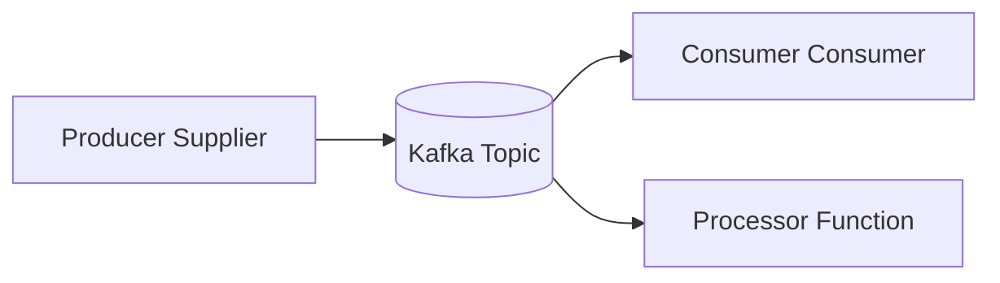

---

# Binders and Bindings

## Binder

A Binder is the messaging-system driver.

Examples:

| Messaging System | Binder |
|---------|---------|
| Kafka | Kafka Binder |
| RabbitMQ | RabbitMQ Binder |
| Pulsar | Pulsar Binder |

---

## Binding

A Binding is a mapping between:

- Spring Bean
- Topic / Queue

Configured through YAML.

### Visualization

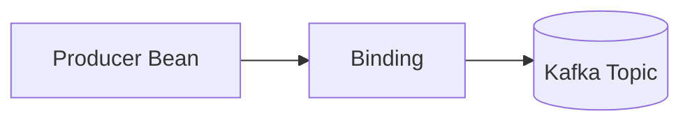

---

# Functional Programming Model

Spring Cloud Stream heavily uses Java 8 Functional Interfaces.

---

## Supplier

Produces messages.

```java
@Bean
public Supplier<OrderEvent> orderEventProducer() {
    return () -> generateOrder();
}
```

---

## Consumer

Consumes messages.

```java
@Bean
public Consumer<OrderEvent> orderEventConsumer() {
    return order -> process(order);
}
```

---

## Function

Consumes and produces messages.

```java
@Bean
public Function<OrderEvent, PaymentEvent> paymentProcessor() {
    return order -> new PaymentEvent();
}
```

---

# Bean Naming Conventions

Spring Cloud Stream automatically maps beans to topics.

## Input Binding

```text
<function-name>-in-<index>
```

Example:

```text
paymentConsumer-in-0
```

---

## Output Binding

```text
<function-name>-out-<index>
```

Example:

```text
orderProducer-out-0
```

---

## Why Index Exists

Used when multiple inputs or outputs are present.

Most applications use:

```text
0
```

---

# Producer Configuration

```yaml
spring:
  cloud:
    function:
      definition: orderEventProducer

    stream:
      bindings:
        orderEventProducer-out-0:
          destination: order-events
```

---

# Consumer Configuration

```yaml
spring:
  cloud:
    function:
      definition: paymentEventConsumer

    stream:
      bindings:
        paymentEventConsumer-in-0:
          destination: payment-events
          group: inventory-service
```

---

# Processor Configuration

```yaml
spring:
  cloud:
    function:
      definition: orderEventProcessor

    stream:
      bindings:

        orderEventProcessor-in-0:
          destination: payment-events
          group: inventory-service

        orderEventProcessor-out-0:
          destination: order-events
```

---

# Multiple Consumers

```yaml
spring:
  cloud:
    function:
      definition: orderEventConsumer;paymentEventConsumer
```

Each consumer gets its own binding.

---

# Single Consumer Reading Multiple Topics

```yaml
spring:
  cloud:
    function:
      definition: orderEventConsumer

    stream:
      bindings:
        orderEventConsumer-in-0:
          destination: order-events,payment-events
```

---

## Best Practice

Prefer:

```text
1 Topic -> 1 Consumer Binding
```

Instead of:

```text
Multiple Topics -> Single Binding
```

Reasons:

- Easier maintenance
- Better observability
- Better ownership
- Cleaner scaling

---

# Topic Auto-Creation

By default:

```text
destination = topic name
```

If the topic doesn't exist:

```text
Spring Cloud Stream creates it automatically
```

Disable auto creation:

```properties
auto.create.topics.enable=false
```

Configured in Kafka broker.

---

# Kafka Binder Configuration

Generic properties work across all messaging systems.

Kafka-specific properties go under:

```yaml
spring:
  cloud:
    stream:
      kafka:
```

Example:

```yaml
spring:
  cloud:
    stream:
      kafka:
        binder:
          brokers:
            - 10.0.0.1:9092
            - 10.0.0.2:9092
            - 10.0.0.3:9092

          producer-properties:
            linger.ms: 100
            batch.size: 5000

          consumer-properties:
            max.poll.records: 100
```

---

# Consumer-Specific Kafka Configuration

```yaml
spring:
  cloud:
    stream:
      kafka:
        bindings:

          orderConsumer-in-0:
            consumer:
              max.poll.records: 100

          paymentConsumer-in-0:
            consumer:
              max.poll.records: 200
```

---

# Required Dependencies

Maven:

```xml
<dependency>
    <groupId>org.springframework.cloud</groupId>
    <artifactId>spring-cloud-stream</artifactId>
</dependency>

<dependency>
    <groupId>org.springframework.kafka</groupId>
    <artifactId>spring-kafka</artifactId>
</dependency>

<dependency>
    <groupId>org.testcontainers</groupId>
    <artifactId>kafka</artifactId>
    <scope>test</scope>
</dependency>
```

---

# Section 02: Reactive Spring Cloud Stream

Spring Cloud Stream supports Reactive Streams through:

- Flux
- Mono

from Project Reactor.

---

## Benefits

- Backpressure support
- Non-blocking processing
- High throughput
- Efficient resource utilization

---

# Important Note

There is no separate Reactive Kafka Binder.

Kafka consumers still run on Kafka consumer threads.

Reactive processing happens after records are received.

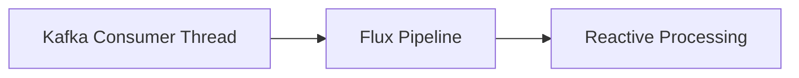

Safe to use with:

- Spring WebFlux
- Reactive applications

---

# Incorrect Reactive Consumer

```java
@Bean
public Consumer<Flux<String>> consumer() {
    return flux ->
            flux.doOnNext(System.out::println)
                    .subscribe();
}
```

### Why Not Recommended?

Spring Cloud Stream already manages subscription.

Manual subscription causes:

- Lifecycle issues
- Resource leaks
- Multiple subscriptions

---

# Recommended Reactive Consumer

```java
@Bean
public Function<Flux<String>, Mono<Void>> consumer() {

    return flux ->
            flux.doOnNext(System.out::println)
                    .then();
}
```

Spring internally subscribes to the Flux.

---

# Multiple Inputs Using Reactive Streams

Suppose:

```java
Flux<Driver> driverStream;
Flux<Passenger> passengerStream;
```

Need to create:

```java
Trip
```

objects.

---

## Using zipWith

```java
driverStream.zipWith(passengerStream)
    .map(tuple ->
        new Trip(tuple.getT1(), tuple.getT2()));
```

---

## Multi-Input Function

```java
@Bean
public Function<
        Tuple2<Flux<Driver>, Flux<Passenger>>,
        Mono<Void>> consumer() {

    return tuple -> {

        Flux<Driver> drivers = tuple.getT1();
        Flux<Passenger> passengers = tuple.getT2();

        return drivers
                .zipWith(passengers)
                .map(t ->
                    new Trip(t.getT1(), t.getT2()))
                .then();
    };
}
```

---

## Binding Configuration

```yaml
spring:
  cloud:
    stream:
      bindings:

        consumer-in-0:
          destination: driver-topic

        consumer-in-1:
          destination: passenger-topic
```

Notice:

```text
in-0
in-1
```

Indices become important for reactive multi-input functions.

---

# Section 03: Poll-Based Suppliers

Supplier beans are automatically invoked by Spring.

Example:

```java
@Bean
Supplier<OrderEvent> producer() {
    return () -> createOrder();
}
```

Internally:

```text
supplier.get()
sendToKafka()
```

---

## Internal Producer Flow

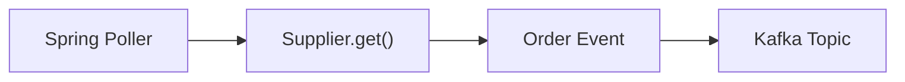

---

## Internal Consumer Flow

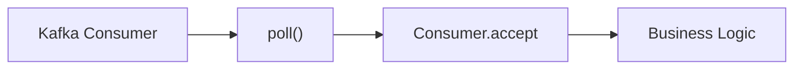

---

# Poller Configuration

```yaml
spring:
  cloud:
    stream:
      poller:
        fixed-delay: 1000
        initial-delay: 0
        time-unit: MILLISECONDS
```

Default:

```text
1000 ms
```

---

# Section 04: StreamBridge

## Why StreamBridge?

Supplier-based publishing is polling-oriented.

But many events are generated immediately.

Examples:

- Product viewed
- Order placed
- User registered
- Inventory threshold crossed

Waiting for a poll cycle is undesirable.

---

# StreamBridge

Spring Cloud Stream provides:

```java
StreamBridge
```

for imperative publishing.

---

## Example

```java
@Autowired
private StreamBridge streamBridge;

streamBridge.send(
    "product-view-out",
    event
);
```

---

# Configuration

```yaml
spring:
  cloud:
    stream:
      bindings:

        product-view-out:
          destination: product-view-events
```

---

# StreamBridge Flow

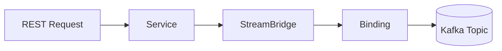

---

# Bean Model vs StreamBridge

## Bean Model

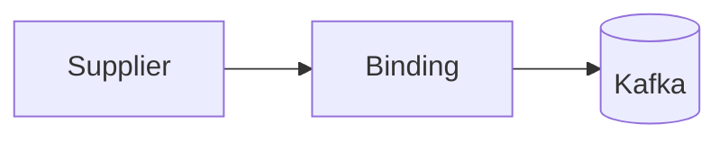

### Best For

- Scheduled publishing
- Fixed streams
- Known flows

---

## StreamBridge

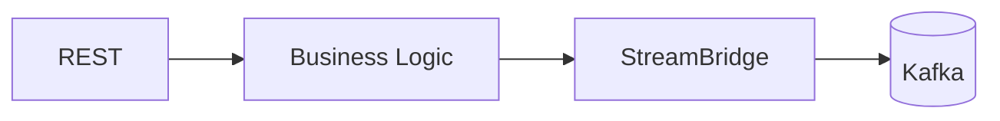

### Best For

- Dynamic publishing
- User actions
- Database events
- External triggers

---

# StreamBridge vs Kafka Streams

| Feature | StreamBridge | Kafka Streams |
|-----------|-----------|-----------|
| Purpose | Publish Messages | Stream Processing |
| Stateful Processing | No | Yes |
| Windowing | No | Yes |
| Aggregation | No | Yes |
| Joins | No | Yes |
| Event Routing | Yes | Limited |
| Learning Curve | Low | High |

---

## Use StreamBridge When

- Sending events
- Routing events
- Triggering workflows

---

## Use Kafka Streams When

- Aggregations
- Joins
- Windowing
- Stateful processing
- Event analytics

---

# Section 05: Reactive Producers

Reactive producers eliminate polling.

---

## Sink Creation

```java
@Bean
Sinks.Many<OrderEvent> sink() {
    return Sinks.many()
            .multicast()
            .onBackpressureBuffer();
}
```

---

## Expose Flux

```java
@Bean
Supplier<Flux<OrderEvent>> publisher(
        Sinks.Many<OrderEvent> sink) {

    return sink::asFlux;
}
```

---

## Emit Events

```java
sink.tryEmitNext(
        new OrderEvent(...)
);
```

---

# Reactive Producer Flow

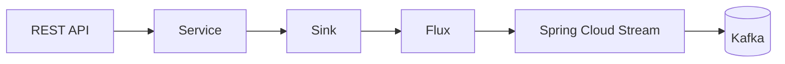

---

## Advantages

- No polling
- Dynamic publishing
- Backpressure support
- Event-driven design

---

# Section 06: Consumer Groups and Scaling

Consumer groups are Kafka's scaling mechanism.

---

# Single Consumer

Topic:

```text
3 Partitions
```

Consumers:

```text
1 Consumer
```

Result:

```text
Consumer gets all 3 partitions
```

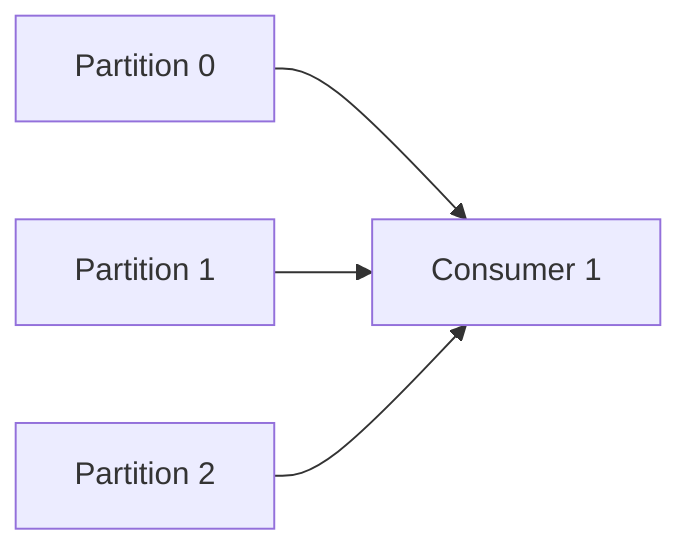

---

# Scale-Out

A second consumer joins.

Kafka rebalances.

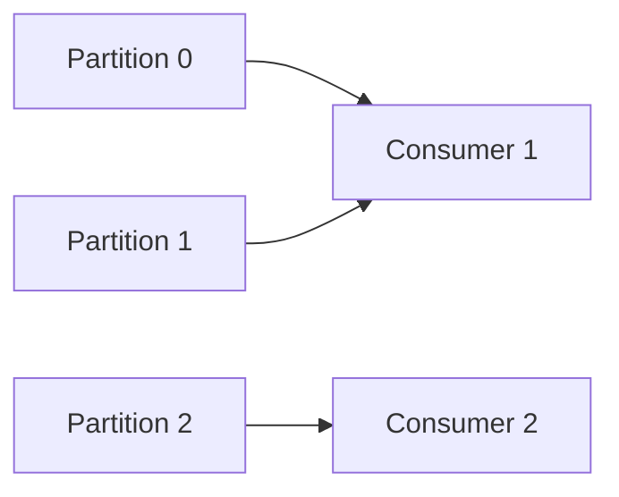

---

# Further Scale-Out

Third consumer joins.

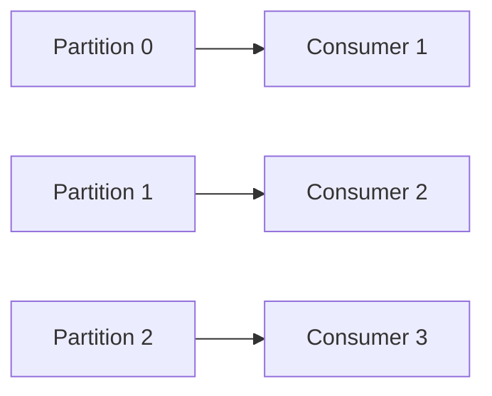

---

# Scale-In

If a consumer leaves:

Kafka automatically rebalances.

Remaining consumers inherit partitions.

---

# Important Rule

Maximum parallelism:

```text
Number of Consumers <= Number of Partitions
```

Example:

| Partitions | Consumers | Active Consumers |
|------------|------------|------------|
| 3 | 1 | 1 |
| 3 | 2 | 2 |
| 3 | 3 | 3 |
| 3 | 5 | 3 |

Extra consumers remain idle.

---

# Message Accounting

For a given consumer group:

```text
Total Produced Messages
=
Total Consumed Messages
```

Across all partitions.

Consumer groups provide:

- Horizontal scaling
- Fault tolerance
- Load balancing
- Rebalancing
- Parallel processing

---

# Section 07: Processors

## What is a Processor?

A Processor consumes an event, performs some business logic, and may optionally produce one or more new events.

Unlike a Consumer, a Processor has both:

- Input Binding
- Output Binding

Example:

```java
@Bean
public Function<OrderEvent, PaymentEvent> paymentProcessor() {

    return order -> {

        // Business logic

        return new PaymentEvent(
                order.orderId(),
                order.amount()
        );
    };
}
```

---

## Processor Architecture

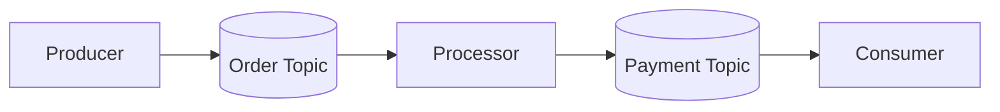

---

# Processor Output Patterns

A processor does not necessarily produce exactly one event.

Common patterns:

1. One-to-One
2. One-to-Zero-or-One
3. One-to-Many

---

# Pattern 1: One-to-One (Map)

Input:

```text
1 Order Event
```

Output:

```text
1 Payment Event
```

---

## Visualization

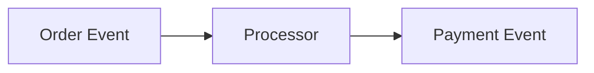

---

## Example

```java
@Bean
public Function<OrderEvent, PaymentEvent>
paymentProcessor() {

    return order ->
            new PaymentEvent(
                    order.id()
            );
}
```

---

# Pattern 2: One-to-0-or-1 (Filter)

Some events may be dropped.

Example:

Only process orders with even IDs.

---

## Visualization

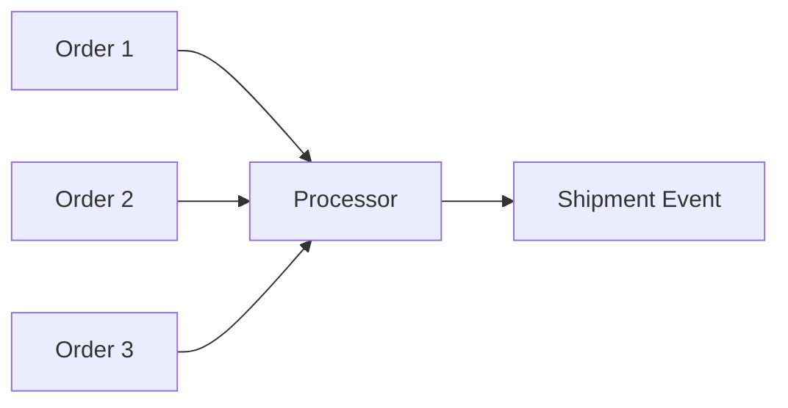

Order 1 and 3 are filtered out.

Only Order 2 generates an output.

---

## Example

```java
@Bean
public Function<OrderEvent, PaymentEvent>
processor() {

    return order -> {

        if(order.id() % 2 != 0) {
            return null;
        }

        return new PaymentEvent(order.id());
    };
}
```

---

# Pattern 3: One-to-Many (FlatMap)

One input event generates multiple output events.

Example:

```text
Order Event
```

creates

```text
Email Notification
SMS Notification
```

---

## Visualization

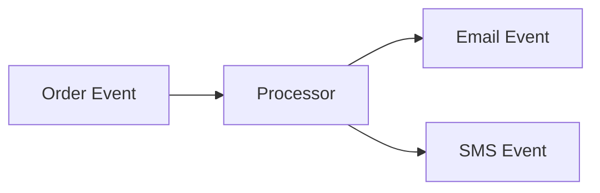

---

## Example

```java
@Bean
public Function<OrderEvent,
        List<NotificationEvent>>
processor() {

    return order -> List.of(
            new EmailEvent(order.id()),
            new SmsEvent(order.id())
    );
}
```

---

# Returning Multiple Messages

Recommended:

```java
List<Message<Notification>>
```

because each Message becomes an independent Kafka record.

---

Avoid:

```java
Message<List<Notification>>
```

because Kafka treats it as a single record.

---

# Processor Configuration

```yaml
spring:
  cloud:
    function:
      definition: paymentProcessor

    stream:
      bindings:

        paymentProcessor-in-0:
          destination: order-events

        paymentProcessor-out-0:
          destination: payment-events
```

---

# Processor Lifecycle

Internally Spring Cloud Stream behaves roughly like:

```java
while(true) {

    OrderEvent order =
            pollFromKafka();

    PaymentEvent payment =
            processor.apply(order);

    sendToKafka(payment);
}
```

---

# Processor Advantages

- Decoupling
- Event transformation
- Event enrichment
- Event routing
- Workflow orchestration

---

# Section 08: Reactive Processors

Reactive processors work with:

- Flux
- Mono

and are automatically subscribed by Spring Cloud Stream.

---

# One-to-One Reactive Processing

```java
@Bean
public Function<
        Flux<OrderEvent>,
        Flux<PaymentEvent>>
processor() {

    return orders ->
            orders.map(order ->
                new PaymentEvent(
                    order.id()
                )
            );
}
```

---

## Visualization

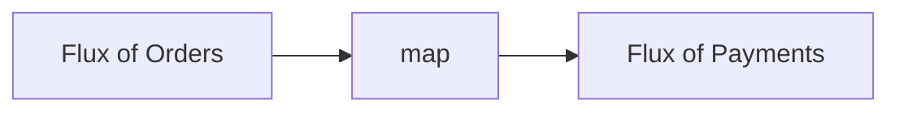

---

# One-to-0-or-1 Reactive Processing

Use:

```java
filter()
```

before:

```java
map()
```

---

## Example

```java
@Bean
public Function<
        Flux<OrderEvent>,
        Flux<PaymentEvent>>
processor() {

    return orders ->

            orders
                .filter(
                    order ->
                        order.id() % 2 == 0
                )
                .map(
                    order ->
                        new PaymentEvent(
                            order.id()
                        )
                );
}
```

---

## Visualization

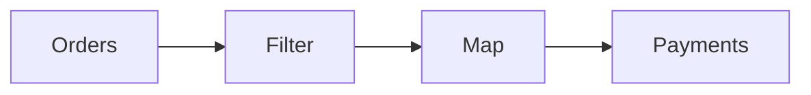

---

# One-to-Many Reactive Processing

Use:

```java
flatMap()
```

---

## Example

```java
@Bean
public Function<
        Flux<OrderEvent>,
        Flux<Notification>>
processor() {

    return orders ->

        orders.flatMap(order ->

            Flux.just(
                new EmailEvent(order.id()),
                new SmsEvent(order.id())
            )
        );
}
```

---

## Visualization

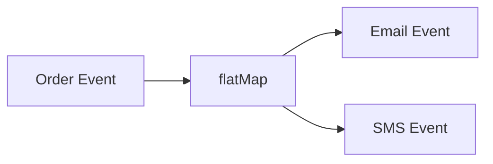

---

# Why Reactive Processors?

Benefits:

- Backpressure
- Better throughput
- Less thread blocking
- Easier composition
- Streaming pipelines

---

# Reactive vs Imperative Processors

| Feature | Imperative | Reactive |
|----------|----------|----------|
| Input | Event | Flux<Event> |
| Output | Event | Flux<Event> |
| Backpressure | No | Yes |
| Throughput | Medium | High |
| Memory Efficiency | Lower | Higher |
| Streaming Support | Limited | Excellent |

---

# Section 09: Content-Based Routing

## What is Event Routing?

Event Routing is the process of directing messages to different destinations based on:

- Event Content
- Business Rules
- Runtime Conditions

---

## Example Scenario

An order contains:

```text
PHYSICAL product
```

or

```text
DIGITAL product
```

Each should be routed differently.

---

## Visualization

```mermaid
flowchart LR

    O[Order Event]

    R[Routing Processor]

    P[(Physical Delivery Topic)]
    D[(Digital Delivery Topic)]

    O --> R

    R --> P
    R --> D
```

---

# Routing Option 1: StreamBridge

Configuration:

```yaml
spring:
  cloud:
    stream:
      bindings:

        physical-delivery-out:
          destination: physical-delivery

        digital-delivery-out:
          destination: digital-delivery
```

---

## Processor

```java
@Bean
Consumer<Order> processor() {

    return order -> {

        if(order.isPhysical()) {

            streamBridge.send(
                    "physical-delivery-out",
                    payload
            );

        } else {

            streamBridge.send(
                    "digital-delivery-out",
                    payload
            );
        }
    };
}
```

---

## Routing Flow

```mermaid
flowchart TD

    A[Order]

    B{Physical?}

    C[Physical Topic]
    D[Digital Topic]

    A --> B

    B -->|Yes| C
    B -->|No| D
```

---

# Routing Option 2: Dynamic Destination Header

Instead of StreamBridge, return a Message.

---

## Example

```java
@Bean
Function<Order, Message<?>>
processor() {

    return order -> {

        String destination =
                order.isPhysical()
                        ? "physical-delivery-out"
                        : "digital-delivery-out";

        return MessageBuilder
                .withPayload(order)
                .setHeader(
                    "spring.cloud.stream.sendto.destination",
                    destination
                )
                .build();
    };
}
```

---

# StreamBridge vs Header Routing

| Feature | StreamBridge | Header Routing |
|----------|----------|----------|
| Simplicity | Easy | Medium |
| Dynamic Topics | Excellent | Excellent |
| Multiple Sends | Yes | No |
| Functional Purity | Lower | Higher |
| Recommended | Most cases | Functional style |

---

# Section 10: Dynamic Routing

Content-based routing uses event data.

Dynamic routing uses external runtime state.

---

## Example

Physical delivery can be handled by:

- FedEx
- USPS

Depending on availability.

---

## Visualization

```mermaid
flowchart LR

    O[Order]

    P[Physical Processor]

    F[(FedEx Topic)]
    U[(USPS Topic)]

    O --> P

    P --> F
    P --> U
```

---

# Runtime Decision

```java
if(fedExAvailable()) {

    streamBridge.send(
            "fedex-delivery-out",
            event
    );

} else {

    streamBridge.send(
            "usps-delivery-out",
            event
    );
}
```

---

# Combined Routing

Applications commonly use:

```text
Content-Based Routing
+
Dynamic Routing
```

Example:

```text
Physical Product
    -> FedEx or USPS

Digital Product
    -> Email Delivery
```

---

## Full Routing Visualization

```mermaid
flowchart TD

    A[Order Event]

    B{Product Type}

    C[Physical]
    D[Digital]

    E{FedEx Available}

    F[FedEx Topic]
    G[USPS Topic]

    H[Digital Topic]

    A --> B

    B -->|Physical| C
    B -->|Digital| D

    C --> E

    E -->|Yes| F
    E -->|No| G

    D --> H
```

---

# Routing Best Practices

### Prefer Content-Based Routing

When:

- Destination depends on payload

Examples:

- Product Type
- Order Category
- Country

---

### Prefer Dynamic Routing

When:

- Destination depends on runtime state

Examples:

- Service Availability
- Vendor Health
- Regional Failover

---

### Avoid

```text
Huge if-else chains
```

Instead:

- Strategy Pattern
- Routing Table
- Configuration Driven Routing

---

# Section 11: Kafka Cluster with Docker Compose

## Why a Kafka Cluster?

A Kafka cluster provides:

- Scalability
- Fault Tolerance
- High Availability
- Data Replication
- Horizontal Scaling

Unlike a single broker setup, production Kafka deployments typically run multiple brokers.

---

# Example Cluster

```mermaid
flowchart LR

    C1[Kafka Broker 1]
    C2[Kafka Broker 2]
    C3[Kafka Broker 3]

    C1 <--> C2
    C2 <--> C3
    C1 <--> C3
```

Each broker can act as:

- Broker
- Controller

(KRaft Mode)

---

# KRaft Mode

Modern Kafka removes ZooKeeper.

Kafka now manages metadata internally using:

```text
KRaft (Kafka Raft)
```

---

# Broker Configuration

Example:

```properties
node.id=1

cluster.id=<same-cluster-id>

process.roles=broker,controller

listeners=INTERNAL://:9092,CONTROLLER://:9093,EXTERNAL://:8081

controller.listener.names=CONTROLLER

inter.broker.listener.name=INTERNAL

advertised.listeners=INTERNAL://kafka1:9092,EXTERNAL://localhost:8081

controller.quorum.voters=\
1@kafka1:9093,\
2@kafka2:9093,\
3@kafka3:9093

listener.security.protocol.map=\
CONTROLLER:PLAINTEXT,\
INTERNAL:PLAINTEXT,\
EXTERNAL:PLAINTEXT

auto.create.topics.enable=false

offsets.topic.replication.factor=3
```

---

# Important Properties

## node.id

Unique identifier per broker.

Example:

```text
Broker 1 -> node.id=1
Broker 2 -> node.id=2
Broker 3 -> node.id=3
```

---

## cluster.id

Unique identifier for the cluster.

Must be identical across all brokers.

Generate:

```bash
kafka-storage.sh random-uuid
```

---

## process.roles

Defines broker responsibilities.

### Broker

Handles:

- Produce requests
- Consume requests
- Storage

### Controller

Handles:

- Metadata
- Leader election
- Cluster state

---

# Listener Architecture

```mermaid
flowchart LR

    A[Client]

    B[EXTERNAL Listener]

    C[Broker]

    D[INTERNAL Listener]

    E[Other Brokers]

    A --> B
    B --> C

    C --> D
    D --> E
```

---

# Listener Types

| Listener | Purpose |
|-----------|-----------|
| INTERNAL | Broker-to-broker communication |
| EXTERNAL | Client communication |
| CONTROLLER | Controller quorum communication |

---

# Security Protocols

Kafka supports:

| Protocol | Encryption | Authentication |
|-----------|-----------|-----------|
| PLAINTEXT | No | No |
| SSL | Yes | No |
| SASL_PLAINTEXT | No | Yes |
| SASL_SSL | Yes | Yes |

---

## Recommendation

| Environment | Protocol |
|------------|------------|
| Local Development | PLAINTEXT |
| Internal Network | SASL_PLAINTEXT |
| Production | SASL_SSL |

---

# Environment Variable Mapping

Kafka Docker images map:

```properties
node.id
```

to

```text
KAFKA_NODE_ID
```

---

General Rule:

```text
a.b.c
```

becomes

```text
KAFKA_A_B_C
```

---

Examples

| Property | Environment Variable |
|------------|------------|
| node.id | KAFKA_NODE_ID |
| listeners | KAFKA_LISTENERS |
| cluster.id | KAFKA_CLUSTER_ID |
| auto.create.topics.enable | KAFKA_AUTO_CREATE_TOPICS_ENABLE |

---

# Docker Compose Structure

## docker-compose.yml

```yaml
# Placeholder
# Will contain:
# kafka1
# kafka2
# kafka3
```

---

## server.env

```properties
# Placeholder

# Common broker configs
# Shared by all brokers
```

---

# Bootstrap Servers

Many developers think:

```yaml
brokers:
  - localhost:9092
```

means only one broker is used.

That is incorrect.

---

## What Actually Happens

```mermaid
flowchart LR

    A[Spring App]

    B[Broker 1]

    C[Cluster Metadata]

    D[Broker 2]
    E[Broker 3]

    A --> B

    B --> C

    C --> D
    C --> E
```

The client connects to one broker initially.

The broker returns metadata for the entire cluster.

The client then knows about:

- Leaders
- Replicas
- Partitions
- All brokers

---

# Section 12: Batch Processing

## Why Batch Processing?

Useful in:

- High throughput systems
- Bulk imports
- Analytics pipelines
- ETL jobs

Benefits:

- Fewer network calls
- Fewer database calls
- Better throughput

---

# Producer-Side Batching

Producer buffers records in memory before sending them.

---

## Producer Batching Properties

```properties
linger.ms
batch.size
compression.type
```

---

# linger.ms

Controls:

```text
How long producer waits
before sending a batch
```

Default:

```text
0 ms
```

---

## Example

```properties
linger.ms=100
```

Producer waits up to:

```text
100 milliseconds
```

for additional messages.

---

# batch.size

Controls maximum batch size.

Default:

```text
16384 bytes (16 KB)
```

Example:

```properties
batch.size=65536
```

---

# compression.type

Compresses data before sending.

---

## Compression Types

| Type | Speed | Compression Ratio | Use Case |
|--------|--------|--------|--------|
| none | Fastest | None | Local Dev |
| gzip | Slow | Best | Archival |
| snappy | Fast | Good | General Purpose |
| lz4 | Very Fast | Good | High Throughput |
| zstd | Excellent | Excellent | Modern Production |

---

# Producer Flow

```mermaid
flowchart LR

    A[Message 1]
    B[Message 2]
    C[Message 3]

    D[Producer Buffer]

    E[Compressed Batch]

    F[Kafka Broker]

    A --> D
    B --> D
    C --> D

    D --> E

    E --> F
```

---

# Consumer-Side Batching

Consumers fetch records in batches.

---

## Important Properties

```properties
max.poll.records
fetch.min.bytes
fetch.max.wait.ms
```

---

# max.poll.records

Maximum records returned per poll.

Default:

```text
500
```

Example:

```properties
max.poll.records=1000
```

---

# fetch.min.bytes

Minimum amount of data broker collects before responding.

Default:

```text
1 byte
```

---

# fetch.max.wait.ms

Maximum wait time before broker responds.

Default:

```text
500 ms
```

---

# Example Configuration

```properties
max.poll.records=1000
fetch.min.bytes=1024
fetch.max.wait.ms=500
```

---

# Problem with Traditional Consumer

```java
@Bean
Consumer<String> consumer() {

    return message -> {

        repo.save(entity);
    };
}
```

Even though Kafka fetches in batches:

```text
DB writes still happen one-by-one
```

---

# End-to-End Batch Processing

Enable:

```yaml
spring:
  cloud:
    stream:
      bindings:
        consumer-in-0:
          consumer:
            batch-mode: true
```

---

# Batch Consumer

```java
@Bean
Consumer<List<String>> consumer() {

    return messages -> {

        repo.saveAll(
            entities
        );
    };
}
```

---

## Visualization

```mermaid
flowchart LR

    A[1000 Records]

    B[Kafka Batch Fetch]

    C[Spring Batch Consumer]

    D[Single saveAll Call]

    A --> B
    B --> C
    C --> D
```

---

# Accessing Metadata in Batch Mode

Use:

```java
@Bean
Consumer<Message<List<String>>>
consumer() {

    return message -> {

        List<String> payloads =
                message.getPayload();

        List<String> keys =
                message.getHeaders()
                       .get(
                         KafkaHeaders.RECEIVED_KEY,
                         List.class
                       );
    };
}
```

---

# Important Rule

Allowed:

```java
Message<List<String>>
```

---

Not Allowed:

```java
List<Message<String>>
```

because Spring Cloud Stream expects:

```text
One message
containing batch metadata
```

---

# Batch Processing Best Practices

### Good Candidates

- Bulk imports
- Reporting
- ETL pipelines
- Analytics

---

### Avoid Batch Mode For

- Real-time notifications
- User interactions
- Low latency workflows

---

# Batching Summary

Producer Batching:

```text
linger.ms
batch.size
compression.type
```

Consumer Batching:

```text
max.poll.records
fetch.min.bytes
fetch.max.wait.ms
batch-mode=true
```

Benefits:

- Higher throughput
- Lower network usage
- Lower DB overhead

---

# Section 13: Concurrent Message Processing

## Default Behavior

Spring Cloud Stream uses:

```text
Single-threaded consumption
```

per binding.

---

# Default Flow

```mermaid
flowchart LR

    P0[Partition 0]
    P1[Partition 1]
    P2[Partition 2]

    C[Single Consumer]

    P0 --> C
    P1 --> C
    P2 --> C
```

One consumer handles all partitions assigned to it.

---

# Enabling Concurrency

```yaml
spring:
  cloud:
    stream:
      bindings:
        orderConsumer-in-0:
          consumer:
            concurrency: 3
```

---

# What Spring Does Internally

Conceptually:

```java
Consumer<OrderEvent> handler =
        orderConsumer();

ExecutorService pool =
        Executors.newFixedThreadPool(3);

for(int i=0;i<3;i++) {

    pool.submit(() -> {

        KafkaConsumer consumer =
                createConsumer();

        joinConsumerGroup();

        while(true) {

            OrderEvent event =
                    pollFromKafka();

            handler.accept(event);
        }
    });
}
```

---

# Visualization

```mermaid
flowchart LR

    P0[Partition 0]
    P1[Partition 1]
    P2[Partition 2]

    T1[Thread 1]
    T2[Thread 2]
    T3[Thread 3]

    P0 --> T1
    P1 --> T2
    P2 --> T3
```

---

# Important Fact

Kafka treats each thread as:

```text
Independent Consumer
```

inside the same group.

---

# Maximum Useful Concurrency

```text
Concurrency <= Number of Partitions
```

Example:

| Partitions | Concurrency |
|------------|------------|
| 3 | 3 |
| 3 | 5 ❌ |
| 10 | 10 |
| 20 | 15 |

---

# Benefits

- Better throughput
- Faster processing
- Easier scaling

---

# Drawbacks

- Increased memory usage
- More Kafka consumers
- More rebalances

---

# Section 14: Application-Level Concurrency

Framework concurrency is not always enough.

---

## Problem Scenario

Producer:

```text
100,000 msgs/sec
```

Consumer:

```text
5,000 msgs/sec
```

Even with:

```yaml
concurrency: 10
```

consumer may still fall behind.

---

# Solution

Consume batches and process records concurrently inside the application.

---

## Scenario 1: Ordering Not Important

```java
@Bean
Function<
    List<Order>,
    List<Message<Object>>
>
processor() {

    return orders ->
            processInParallel(
                    orders
            );
}
```

---

# Visualization

```mermaid
flowchart LR

    A[Batch]

    B1[Virtual Thread]
    B2[Virtual Thread]
    B3[Virtual Thread]

    A --> B1
    A --> B2
    A --> B3
```

Each order processed independently.

---

# Scenario 2: Ordering Matters

Suppose:

```text
customerId
```

determines ordering.

---

# Example

Orders:

```text
C1 O1
C1 O2
C1 O3

C2 O1
C2 O2
```

---

## Group By Customer

```java
orders.stream()
      .collect(
        Collectors.groupingBy(
            Order::customerId
        )
      );
```

---

# Visualization

```mermaid
flowchart LR

    A[Incoming Orders]

    B1[Customer 1 Bucket]
    B2[Customer 2 Bucket]

    T1[Thread 1]
    T2[Thread 2]

    A --> B1
    A --> B2

    B1 --> T1
    B2 --> T2
```

---

# Processing Rules

Within bucket:

```text
Sequential
```

Across buckets:

```text
Concurrent
```

This preserves ordering while increasing throughput.

---

# Framework vs Application Concurrency

| Feature | Framework Concurrency | App Concurrency |
|----------|----------|----------|
| Uses Partitions | Yes | No |
| Uses Extra Threads | Yes | Yes |
| Ordering Control | Limited | Full |
| Scaling Limit | Partition Count | Hardware |
| Complexity | Low | High |

---

# Section 15: Manual Acknowledgement (ACK/NACK)

## Message Acknowledgement

Kafka tracks progress using:

```text
Offsets
```

An offset is Kafka's way of knowing:

```text
Which records have already been processed
```

---

# Automatic Acknowledgement

Default behavior:

```text
Spring Cloud Stream
    ->
Processes Message
    ->
Commits Offset
```

---

## Visualization

```mermaid
flowchart LR

    A[Consume Record]

    B[Process Successfully]

    C[Commit Offset]

    A --> B
    B --> C
```

---

# Why Manual ACK?

Sometimes you need complete control over:

- Offset commits
- Error handling
- External systems
- Long-running workflows

Examples:

- Database writes
- API calls
- Payment processing
- File uploads

You may want to commit offsets only after those operations succeed.

---

# Enabling Manual ACK

## Configuration

```yaml
spring:
  cloud:
    stream:
      kafka:
        bindings:

          orderConsumer-in-0:
            consumer:
              ack-mode: MANUAL
```

---

# Consumer Definition

Use:

```java
Consumer<Message<OrderEvent>>
```

instead of:

```java
Consumer<OrderEvent>
```

because ACK is stored inside message headers.

---

## Example

```java
@Bean
Consumer<Message<OrderEvent>>
consumer() {

    return message -> {

        Acknowledgment ack =
                message.getHeaders()
                       .get(
                         KafkaHeaders.ACKNOWLEDGMENT,
                         Acknowledgment.class
                       );

        process(message.getPayload());

        ack.acknowledge();
    };
}
```

---

# ACK Flow

```mermaid
flowchart LR

    A[Kafka Record]

    B[Consumer]

    C[Business Logic]

    D[Acknowledge]

    E[Offset Commit]

    A --> B
    B --> C
    C --> D
    D --> E
```

---

# Important Note

Calling:

```java
ack.acknowledge();
```

does NOT necessarily commit immediately.

Spring batches commits internally.

---

# Immediate Commit

Configuration:

```yaml
ack-mode: MANUAL_IMMEDIATE
```

Now:

```java
ack.acknowledge();
```

results in:

```text
Immediate Offset Commit
```

---

# Negative Acknowledgement (NACK)

Kafka itself has:

```text
NO NACK CONCEPT
```

NACK is implemented by the framework.

---

# Example

```java
try {

    process(event);

    ack.acknowledge();

}
catch(Exception ex) {

    ack.nack(
        Duration.ofSeconds(5)
    );
}
```

---

# NACK Flow

```mermaid
flowchart LR

    A[Consume]

    B[Processing]

    C{Success?}

    D[Acknowledge]

    E[NACK]

    F[Retry Later]

    A --> B

    B --> C

    C -->|Yes| D
    C -->|No| E

    E --> F
```

---

# What Happens During NACK?

Example:

```java
ack.nack(
    Duration.ofSeconds(5)
);
```

Behavior:

```text
Record NOT committed

Record re-delivered

5 seconds later

Again and again

Until acknowledged
```

---

# Important Warning

When using:

```text
MANUAL ACK
```

EVERY record must eventually be:

```java
ack.acknowledge();
```

Otherwise:

```text
Kafka keeps redelivering
```

---

# Batch ACK

Batch mode still gives:

```text
ONE ACK OBJECT
```

for the entire batch.

---

## Example

```java
@Bean
Consumer<Message<List<OrderEvent>>>
consumer() {

    return message -> {

        Acknowledgment ack =
            message.getHeaders()
                .get(
                    KafkaHeaders.ACKNOWLEDGMENT,
                    Acknowledgment.class
                );

        try {

            for(var event :
                message.getPayload()) {

                process(event);
            }

            ack.acknowledge();

        }
        catch(Exception e) {

            ack.nack(
                Duration.ofSeconds(5)
            );
        }
    };
}
```

---

# Batch Failure Scenario

Batch:

```text
500 records
```

Failure:

```text
Record #499
```

---

Result:

```text
Entire Batch Re-delivered
```

---

## Visualization

```mermaid
flowchart LR

    A[500 Records]

    B[Process 498]

    C[Fail at 499]

    D[NACK]

    E[Retry Entire Batch]

    A --> B
    B --> C
    C --> D
    D --> E
```

---

# ACK Best Practices

Use Manual ACK when:

- External dependencies exist
- Exactly-once workflow needed
- Offset control required

Avoid when:

- Simple consumers
- High throughput systems
- Default behavior is sufficient

---

# Section 16: Error Handling & Dead Letter Topics (DLT)

## Expected Message Lifecycle

| Scenario | Action |
|-----------|-----------|
| Success | Commit Offset |
| Retryable Failure | Retry |
| Retry Exhausted | Send to DLT |
| Non-Retryable Failure | Send to DLT |
| Unknown Failure | Retry or DLT |

---

# Error Handling Flow

```mermaid
flowchart LR

    A[Message]

    B[Process]

    C{Success?}

    D[Commit]

    E{Retryable?}

    F[Retry]

    G[DLT]

    A --> B
    B --> C

    C -->|Yes| D
    C -->|No| E

    E -->|Yes| F
    E -->|No| G

    F --> B
```

---

# Internal Processing

Conceptually:

```java
while(true) {

    OrderEvent event =
            pollFromKafka();

    try {

        handler.accept(event);

        commitOffset();

    } catch(Exception ex) {

        // retry or DLT
    }
}
```

---

# Example Business Rules

```java
if(orderId < 1)
    throw new InputValidationException();

if(orderId > 5)
    throw new ServiceUnavailableException();
```

---

# Retry Configuration

```yaml
spring:
  cloud:
    stream:
      bindings:

        consumer-in-0:
          consumer:

            max-attempts: 3

            back-off-initial-interval: 2000

            back-off-multiplier: 1.0
```

---

# Retry Timeline

```text
Attempt 1

2 seconds

Attempt 2

2 seconds

Attempt 3

Fail
```

---

# Important Rule

```text
max-attempts
includes
the first delivery
```

---

Example:

```yaml
max-attempts: 3
```

Means:

```text
1 initial attempt

+
2 retries
```

---

# Retryable Exceptions

Default:

```text
Retry everything
```

---

# Custom Retry Rules

```yaml
spring:
  cloud:
    stream:
      bindings:
        consumer-in-0:
          consumer:

            default-retryable: false

            retryable-exceptions:

              com.example.InputValidationException: false

              com.example.ServiceUnavailableException: true
```

---

# Behavior

| Exception | Retry? |
|------------|------------|
| InputValidationException | No |
| ServiceUnavailableException | Yes |

---

# Dead Letter Topic (DLT)

## What Is It?

A Kafka topic containing messages that could not be processed.

Reasons:

- Invalid Data
- Corrupt Data
- Business Rule Failures
- Permanent Errors
- Retry Exhaustion

---

# DLT Flow

```mermaid
flowchart LR

    A[Original Topic]

    B[Consumer]

    C[Retry]

    D[DLT]

    A --> B

    B --> C

    C --> D
```

---

# Enable DLT

```yaml
spring:
  cloud:
    stream:
      kafka:
        bindings:

          consumer-in-0:
            consumer:

              enable-dlq: true

              dlq-name:
                demo-topic-dlq
```

---

# Complete Flow

```mermaid
flowchart LR

    A[Topic]

    B[Consumer]

    C[Retry 1]

    D[Retry 2]

    E[Retry 3]

    F[DLT]

    A --> B
    B --> C
    C --> D
    D --> E
    E --> F
```

---

# Why DLT Is Valuable

Allows:

- Later inspection
- Reprocessing
- Root-cause analysis
- Operational visibility

---

# Typical DLT Processing

```mermaid
flowchart LR

    A[DLT]

    B[Support Team]

    C[Fix Problem]

    D[Replay Message]

    A --> B
    B --> C
    C --> D
```

---

# Section 17: Dynamic Pause & Resume

## The Problem

Suppose:

```text
Database Down
```

Consumer starts failing.

Retries happen repeatedly.

DLT fills rapidly.

---

# Better Approach

Pause consumption until dependency recovers.

---

## Visualization

```mermaid
flowchart LR

    A[Kafka]

    B[Consumer]

    C[Database Down]

    D[Pause Binding]

    E[Database Healthy]

    F[Resume Binding]

    A --> B
    B --> C
    C --> D

    D --> E

    E --> F
```

---

# BindingLifecycleController

Spring provides:

```java
BindingLifecycleController
```

---

## Inject

```java
@Autowired
BindingLifecycleController controller;
```

---

# Pause Binding

```java
controller.changeState(
    "consumer-in-0",
    State.PAUSED
);
```

---

# Resume Binding

```java
controller.changeState(
    "consumer-in-0",
    State.RESUMED
);
```

---

# Query State

```java
controller.queryState(
    "consumer-in-0"
);
```

---

# Why Query Returns List

With:

```yaml
concurrency: 3
```

Spring creates:

```text
3 Binding Instances
```

Therefore:

```java
List<Binding<?>>
```

is returned.

---

# Recommended Pattern

```mermaid
flowchart LR

    A[Health Checker]

    B{Dependency Healthy?}

    C[Resume]

    D[Pause]

    A --> B

    B -->|Yes| C
    B -->|No| D
```

---

# Use Cases

- Database outages
- Third-party APIs
- Network failures
- Maintenance windows

---

# Section 18: Kafka Transactions

## Why Transactions?

Transactions provide:

```text
Atomicity
```

Meaning:

```text
Everything succeeds

OR

Everything fails
```

---

# Database Example

Transfer:

```json
{
  "from": "mike",
  "to": "john",
  "amount": 10
}
```

---

## Transaction

```sql
BEGIN;

UPDATE accounts
SET amount = amount - 10
WHERE name='mike';

UPDATE accounts
SET amount = amount + 10
WHERE name='john';

COMMIT;
```

---

# Kafka Equivalent

Input:

```json
{
  "from":"mike",
  "to":"john",
  "amount":10
}
```

Output:

```json
{
  "account":"john",
  "type":"CREDIT",
  "amount":10
}
```

```json
{
  "account":"mike",
  "type":"DEBIT",
  "amount":10
}
```

---

# Transactional Processing

```mermaid
flowchart LR

    A[Transfer Request]

    B[Processor]

    C[Credit Event]

    D[Debit Event]

    A --> B

    B --> C
    B --> D
```

---

# Desired Behavior

```java
try {

    consume();

    produceCredit();

    produceDebit();

    acknowledge();

}
catch(Exception ex) {

    rollback();
}
```

---

# Transaction Coordinator

Kafka internally uses:

```text
Transaction Coordinator (TC)
```

---

## Responsibilities

- Track open transactions
- Track commits
- Track aborts
- Handle timeouts

---

## Visualization

```mermaid
flowchart LR

    P[Processor]

    TC[Transaction Coordinator]

    T[(Transaction Topic)]

    P --> TC
    TC --> T
```

---

# Transaction Commit

```mermaid
sequenceDiagram

    participant P as Processor
    participant TC as Transaction Coordinator

    P->>TC: Begin TX-1

    P->>TC: Produce Credit

    P->>TC: Produce Debit

    P->>TC: Commit TX-1

    TC->>TC: Write Commit Marker
```

---

# Transaction Abort

```mermaid
sequenceDiagram

    participant P as Processor
    participant TC as Transaction Coordinator

    P->>TC: Begin TX-1

    P->>TC: Produce Credit

    P->>TC: Produce Debit

    P->>TC: Abort TX-1

    TC->>TC: Write Abort Marker
```

---

# Crash Scenario

```mermaid
sequenceDiagram

    participant P as Processor
    participant TC as Coordinator

    P->>TC: Begin TX

    P->>TC: Produce Records

    Note over P: Crash

    TC->>TC: Wait transaction.timeout.ms

    TC->>TC: Abort Transaction
```

---

# Transaction Configuration

```yaml
spring:
  cloud:
    stream:
      kafka:
        binder:
          transaction:
            transaction-id-prefix: tx-
```

---

# Why Prefix?

Spring generates:

```text
tx-1
tx-2
tx-3
...
```

automatically.

---

# Producer Configuration

```yaml
spring:
  cloud:
    stream:
      kafka:
        binder:
          transaction:
            producer:
              configuration:

                acks: all
```

---

# Why acks=all?

Ensures:

```text
Leader +
All ISR Replicas
```

acknowledge the write.

---

# Consumer Isolation Levels

Controls what consumers can see.

---

## read_uncommitted

Default Kafka behavior.

Reads:

- Committed Records
- Uncommitted Records
- Aborted Records

---

## read_committed

Reads only:

```text
Successfully Committed Records
```

---

# Visualization

```mermaid
flowchart LR

    A[Committed]

    B[Aborted]

    C[read_uncommitted]

    D[read_committed]

    A --> C
    B --> C

    A --> D
```

---

# Transaction Retry Behavior

Important:

Transaction retries are:

```text
Broker Driven
```

NOT:

```text
Framework Retry
```

---

Result:

```java
deliveryAttempt
```

header always stays:

```text
1
```

even though transaction retries occurred.

---

# Transaction + DLT

Flow:

```mermaid
flowchart LR

    A[Transaction]

    B[Failure]

    C[Abort]

    D[Retry]

    E[DLT]

    A --> B
    B --> C
    C --> D
    D --> E
```

---

# Exactly-Once Processing Caveat

Kafka transactions guarantee:

```text
Exactly Once
inside Kafka
```

---

They do NOT automatically guarantee:

```text
Exactly Once
for your entire application
```

because:

- Databases
- REST APIs
- External systems

may still introduce duplicates.

---

# Kafka Best Practices

This section covers practical Kafka recommendations for building reliable, scalable, and fault-tolerant event-driven systems.

---

# 1. Producer Acknowledgements (acks)

## What Are Producer ACKs?

When a producer sends a message to Kafka, it needs confirmation that the message was successfully written.

This confirmation is called an:

```text
Acknowledgement (ACK)
```

---

# ACK Flow

```mermaid
sequenceDiagram

    participant P as Producer
    participant L as Leader
    participant F as Followers

    P->>L: Send Record

    L->>F: Replicate Record

    F-->>L: Replicated

    L-->>P: ACK
```

---

# ACK Modes

| Value | Meaning | Reliability | Performance |
|---------|---------|---------|---------|
| 0 | No ACK | Lowest | Fastest |
| 1 | Leader ACK Only | Medium | Fast |
| all (-1) | Leader + ISR ACK | Highest | Slowest |

---

## acks=0

Producer sends message and moves on.

```text
No confirmation
```

If broker crashes:

```text
Message may be lost
```

---

## acks=1

Producer waits only for leader.

```text
Leader ACKs
Immediately
```

If leader crashes before replication:

```text
Data Loss Possible
```

---

## acks=all

Producer waits until:

```text
Leader
+
All ISR Replicas
```

acknowledge.

Highest durability.

---

# Visualization

```mermaid
flowchart LR

    P[Producer]

    L[Leader]

    R1[Follower 1]
    R2[Follower 2]

    P --> L

    L --> R1
    L --> R2

    R1 --> L
    R2 --> L

    L --> P
```

---

# Spring Cloud Stream

Usually configured automatically.

```yaml
spring:
  cloud:
    stream:
      kafka:
        binder:
          transaction:
            producer:
              configuration:
                acks: all
```

Recommended for production.

---

# 2. Minimum In-Sync Replicas (min.insync.replicas)

## What Is ISR?

ISR means:

```text
In Sync Replica
```

Replicas that are fully caught up with the leader.

---

# Example

Replication Factor:

```text
3
```

Brokers:

```text
Broker 1 (Leader)
Broker 2 (Follower)
Broker 3 (Follower)
```

---

# Visualization

```mermaid
flowchart LR

    P[Producer]

    L[Leader]

    F1[ISR Replica]
    F2[ISR Replica]

    P --> L

    L --> F1
    L --> F2
```

---

# Property

```properties
min.insync.replicas=1
```

Default value.

---

# What Does It Mean?

Kafka accepts writes if:

```text
At least 1 ISR exists
```

---

# Example

Replication Factor:

```text
3
```

min.insync.replicas:

```text
2
```

Requirement:

```text
At least 2 replicas
must acknowledge
```

before write succeeds.

---

# Recommended Formula

Expected Broker Failures:

```text
N
```

Replication Factor:

```text
N + 1
```

---

Example:

Expected failures:

```text
3
```

Replication Factor:

```text
4
```

---

Recommended:

```text
min.insync.replicas = N + 1
```

or

```text
RF - 1
```

depending on availability requirements.

---

# Example

| Broker Failures Tolerated | Replication Factor |
|---------|---------|
| 1 | 2 |
| 2 | 3 |
| 3 | 4 |

---

# 3. Idempotent Producer

## Problem

Producer sends records.

Kafka writes records.

Kafka sends ACK.

---

But:

```text
ACK lost due to network issue
```

Producer assumes:

```text
Message failed
```

and sends again.

---

# Without Idempotence

```mermaid
sequenceDiagram

    participant P as Producer
    participant K as Kafka

    P->>K: Record

    K->>P: ACK (Lost)

    P->>K: Retry

    K->>K: Duplicate Stored
```

---

Result:

```text
Duplicate Records
```

---

# With Idempotence

Kafka tracks:

```text
Producer ID
Sequence Number
```

---

# Visualization

```mermaid
sequenceDiagram

    participant P as Producer
    participant K as Kafka

    P->>K: Seq 100

    K->>P: ACK Lost

    P->>K: Seq 100 Retry

    K->>K: Duplicate Detected

    K->>P: ACK
```

---

Result:

```text
Record Stored Once
```

---

# Property

```properties
enable.idempotence=true
```

---

# Important Note

Modern Kafka enables this by default.

---

# What It Protects Against

Protects:

```text
Producer Retries
```

---

Does NOT protect against:

```text
Application producing
same event twice
```

---

# Example

Bad:

```java
producer.send(order);

producer.send(order);
```

These are two distinct records.

Kafka stores both.

---

# 4. Duplicate Messages Still Possible

Even with:

```properties
enable.idempotence=true
```

duplicates can still occur.

---

# Example

Application Bug

```java
createOrderEvent();

createOrderEvent();
```

Both have:

```text
Different Sequence IDs
```

Kafka stores both.

---

# Important Rule

Producer idempotence prevents:

```text
Duplicate Retries
```

NOT:

```text
Duplicate Business Events
```

---

# 5. Idempotent Consumer

Kafka provides:

```text
NO Built-in Idempotent Consumer
```

You must implement it.

---

# Why?

Consumers may receive:

```text
Same Record More Than Once
```

due to:

- Retries
- Rebalances
- Crashes
- Redelivery

---

# Solution

Assign a unique ID.

Example:

```java
UUID messageId
```

inside:

- Payload
- Header

Either works.

---

# Consumer Flow

```mermaid
flowchart LR

    A[Kafka Record]

    B[Check Processed Table]

    C{Exists?}

    D[Skip]

    E[Process]

    F[Insert Message ID]

    A --> B

    B --> C

    C -->|Yes| D

    C -->|No| E

    E --> F
```

---

# Example Table

```sql
processed_messages
```

Columns:

```text
message_id
processed_at
```

---

# Pseudocode

```java
if(repository.exists(id)) {

    acknowledge();

    return;
}

process();

repository.save(id);

acknowledge();
```

---

# Benefits

Provides:

```text
Application-Level
Exactly Once Processing
```

---

# 6. Compression

Compression reduces:

- Network Traffic
- Broker Disk Usage
- Replication Cost

---

# Producer Property

```properties
compression.type
```

---

# Supported Algorithms

| Algorithm | Compression Ratio | CPU Cost | Use Case |
|------------|------------|------------|------------|
| none | None | Lowest | Local Development |
| gzip | Best | High | Archival |
| snappy | Good | Low | General Purpose |
| lz4 | Good | Very Low | High Throughput |
| zstd | Excellent | Medium | Modern Production |

---

# Visualization

```mermaid
flowchart LR

    A[Producer Records]

    B[Compression]

    C[Kafka Broker]

    A --> B
    B --> C
```

---

# Recommendation

Production:

```properties
compression.type=zstd
```

or

```properties
compression.type=lz4
```

---

# 7. How Many Partitions?

## Common Misconception

More partitions ≠ Always Better

Partitions provide:

```text
Parallelism
```

---

# Example 1

Producer:

```text
1000 msgs/sec
```

Consumer:

```text
100 msgs/sec
```

Need:

```text
~10 Consumers
```

Therefore:

```text
At least 10 partitions
```

---

# Visualization

```mermaid
flowchart LR

    P[Producer]

    T[12 Partitions]

    C1[Consumer]
    C2[Consumer]
    C3[Consumer]
    C4[Consumer]

    P --> T

    T --> C1
    T --> C2
    T --> C3
    T --> C4
```

---

# Example 2

Producer:

```text
100,000 msgs/sec
```

Consumer:

```text
10,000,000 msgs/sec
```

One consumer is enough.

Still:

```text
1 partition
```

may become producer bottleneck.

Use:

```text
3-5 partitions
```

for write scalability.

---

# Partition Sizing Rule

Consider:

- Producer throughput
- Consumer throughput
- Future growth
- Rebalancing cost

---

# Too Many Partitions

Problems:

- Longer rebalances
- More metadata
- More memory
- More open files

---

# 8. Replication Factor Strategy

Replication provides:

```text
Availability
```

---

# Example

Replication Factor:

```text
3
```

Topic:

```mermaid
flowchart LR

    L[Leader]

    F1[Follower]

    F2[Follower]

    L --> F1
    L --> F2
```

---

# Choosing RF

Question:

```text
How many brokers
can fail simultaneously?
```

---

# Formula

Expected failures:

```text
N
```

Replication Factor:

```text
N + 1
```

---

# Example

Need to tolerate:

```text
3 Broker Failures
```

Choose:

```text
RF = 4
```

---

# Availability vs Cost

| RF | Storage Cost | Availability |
|---------|---------|---------|
| 1 | Low | Poor |
| 2 | Medium | Good |
| 3 | Higher | Excellent |
| 4+ | Highest | Very High |

---

# Kafka Capacity Planning

Remember:

```text
Broker
=
Capacity
```

---

```text
Partition
=
Scalability
```

---

```text
Replica
=
Availability
```

---

# Quick Cheat Sheet

| Requirement | Recommendation |
|------------|------------|
| Production ACKs | acks=all |
| Producer Safety | enable.idempotence=true |
| Consumer Safety | Idempotent Consumer Pattern |
| Compression | zstd / lz4 |
| Fault Tolerance | RF >= 3 |
| Throughput Scaling | More Partitions |
| Availability | More Replicas |
| Faster Consumption | More Consumers |
| Consumer Scaling | Partitions >= Consumers |

### Reliability

- acks=all
- min.insync.replicas
- Replication Factor
- Idempotent Producer
- Idempotent Consumer

### Performance

- Compression
- Batching
- Concurrency

### Scalability

- Consumer Groups
- Partitions
- Multiple Brokers

### Availability

- Replicas
- ISR
- Cluster Design

---